<div align="center">
  <picture>
    <source media="(prefers-color-scheme: dark)" srcset="https://capsule-render.vercel.app/api?type=waving&color=0:0a0a1a,50:3b82f6,100:00f0ff&height=200&section=header&text=claude-reports&fontSize=42&fontColor=e0e0e8&fontAlignY=35&desc=13%20visual%20styles%20for%20markdown-to-HTML%20reports&descSize=16&descColor=888&descAlignY=55&animation=fadeIn" />
    <source media="(prefers-color-scheme: light)" srcset="https://capsule-render.vercel.app/api?type=waving&color=0:3b82f6,50:818cf8,100:00f0ff&height=200&section=header&text=claude-reports&fontSize=42&fontColor=ffffff&fontAlignY=35&desc=13%20visual%20styles%20for%20markdown-to-HTML%20reports&descSize=16&descColor=f0f0f0&descAlignY=55&animation=fadeIn" />
    
  </picture>
</div>

<p align="center">
  
  
  
  
  <br />
  <a href="https://alcatraz627.github.io/claude-reports/">📖 Style Gallery</a> · <a href="https://github.com/alcatraz627/claude-reports/actions/workflows/generate-report.yml">🚀 Generate a Report</a>
</p>

---

## About

**claude-reports** converts structured JSON (parsed from markdown) into polished, self-contained HTML reports. Each generated file is a single `index.html` with all CSS and JS inlined — no external local dependencies, works offline, can be emailed or shared as-is.

The architecture separates **content parsing** (LLM or script produces JSON) from **rendering** (TypeScript generator outputs styled HTML). This means you can restyle any report without re-parsing the source data — just run the restyle script with a different style name.

Includes 13 production-ready visual styles covering everything from clean reading layouts to cyberpunk neon dashboards, plus a standalone interactive table generator.

## Quick Start

```bash
# Clone
git clone https://github.com/alcatraz627/claude-reports.git
cd claude-reports

# Install
npm install

# Generate a report from JSON data
npx tsx generate-html.ts data.json output/index.html --style minimal

# Restyle an existing report (no re-parsing needed)
bash restyle-report.sh output/ neon
```

## How It Works

```
  ┌──────────┐       ┌──────────────┐       ╭───────────╮
  │ Markdown │──────▶│ LLM / Script │──────▶│ data.json │
  └──────────┘ parse └──────────────┘       ╰─────┬─────╯
                                                  │
                    ┌─────────────────────────────┘
                    ▼
  ┌──────────────────┐   ┌─────────────────┐   ┌───────────┐
  │ generate-html.ts │   │ shared-base.css │   │ shared.js │
  └────────┬─────────┘   └─────────────────┘   └───────────┘
           │
           ├── style = minimal ──▶  ╭──────────────╮
           ├── style = neon    ──▶  │  index.html  │  (self-contained)
           ├── style = terminal──▶  ╰──────────────╯
           └── ...13 styles              │
                                         │  + data.json saved alongside
                                         ▼
                              ┌────────────────────┐
                              │  restyle-report.sh │──▶ new style,
                              │  (reuses data.json)│    no re-parse
                              └────────────────────┘
```

### Input JSON Schema

The generator expects a JSON file with this structure:

```json
{
  "title": "Report Title",
  "subtitle": "Optional subtitle",
  "generated": "2026-04-18",
  "nav": [
    { "id": "section-slug", "text": "Section Name", "level": 2 }
  ],
  "sections": [
    {
      "id": "section-slug",
      "heading": "Section Name",
      "level": 2,
      "blocks": [
        { "type": "paragraph", "html": "Text with <strong>inline</strong> HTML" },
        { "type": "code", "lang": "typescript", "content": "const x = 1;" },
        { "type": "table", "headers": ["Col1", "Col2"], "rows": [["a", "b"]] },
        { "type": "ul", "items": ["Item 1", "Item 2"] },
        { "type": "tree", "nodes": [{ "label": "src/", "children": [...] }] },
        { "type": "math", "latex": "E = mc^2", "display": true }
      ]
    }
  ]
}
```

**Supported block types:** `paragraph`, `code`, `table`, `ul`, `ol`, `blockquote`, `hr`, `math`, `tree`, `subsection`, `subsubsection`

## Styles

<table>
<tr>
<td align="center" width="33%"><strong>default</strong><br/>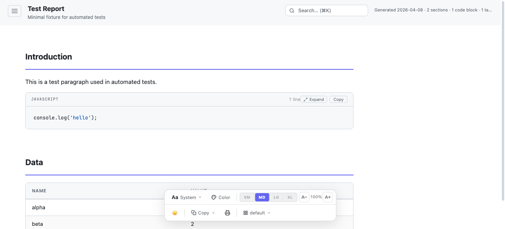<br/><sub>Dark sidebar with accent colors, font/color/width pickers</sub></td>
<td align="center" width="33%"><strong>minimal</strong><br/>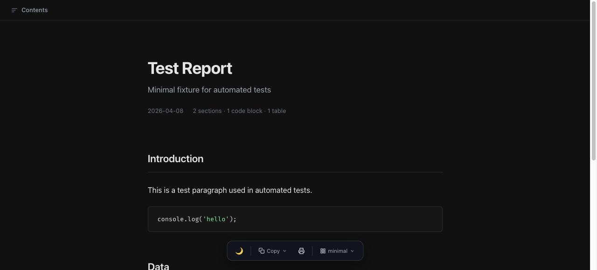<br/><sub>Ultra-clean reading-focused layout with maximum whitespace</sub></td>
<td align="center" width="33%"><strong>notion</strong><br/>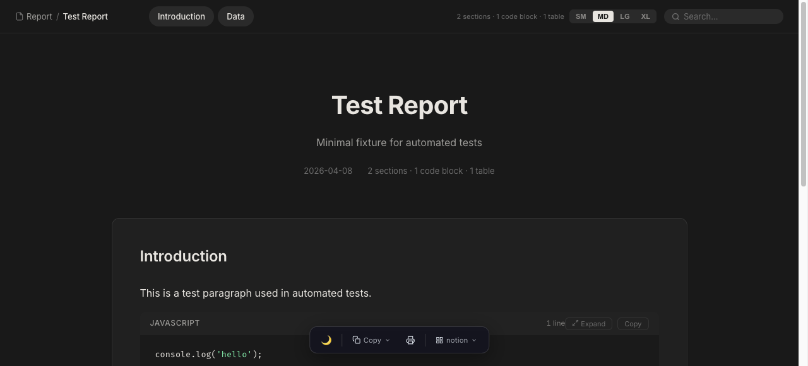<br/><sub>Clean, minimal Notion-style with cards and whitespace</sub></td>
</tr>
<tr>
<td align="center"><strong>dashboard</strong><br/>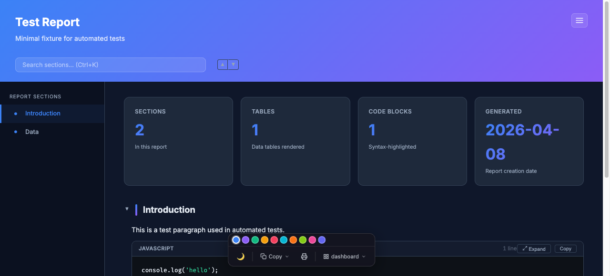<br/><sub>Dark analytics dashboard with metric cards and status pills</sub></td>
<td align="center"><strong>data-table</strong><br/>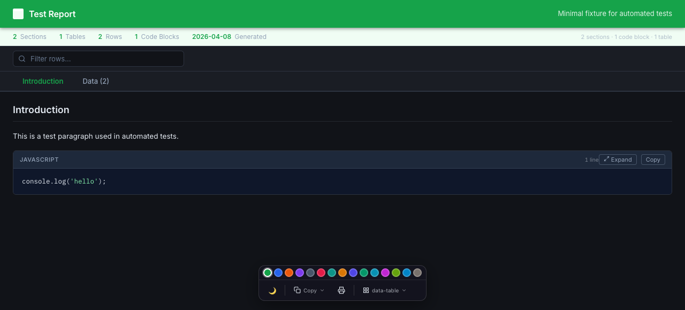<br/><sub>Data-heavy spreadsheet layout optimized for tables</sub></td>
<td align="center"><strong>neon</strong><br/>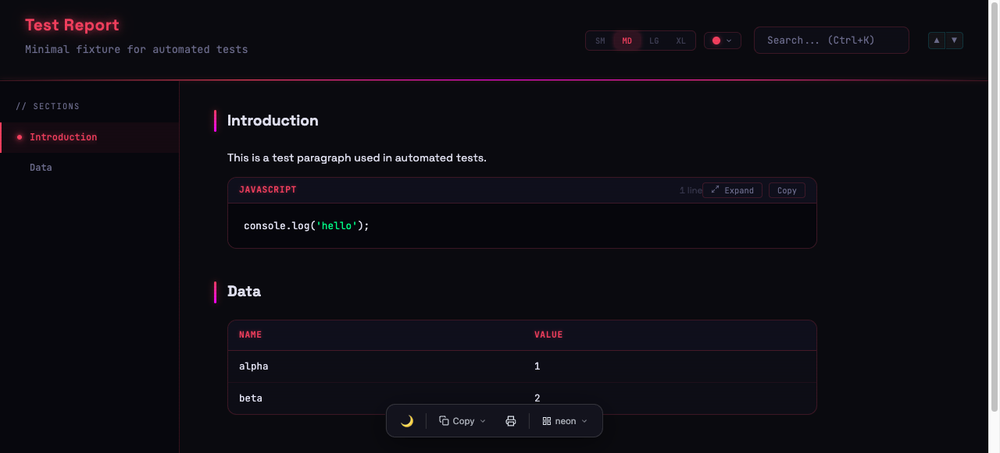<br/><sub>Cyberpunk neon-glow dark theme with 18 accent presets</sub></td>
</tr>
<tr>
<td align="center"><strong>terminal</strong><br/>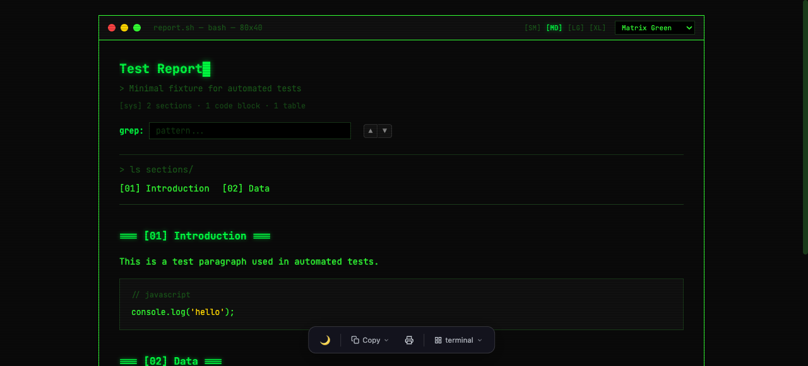<br/><sub>Green-on-black retro terminal with CRT scanlines</sub></td>
<td align="center"><strong>magazine</strong><br/>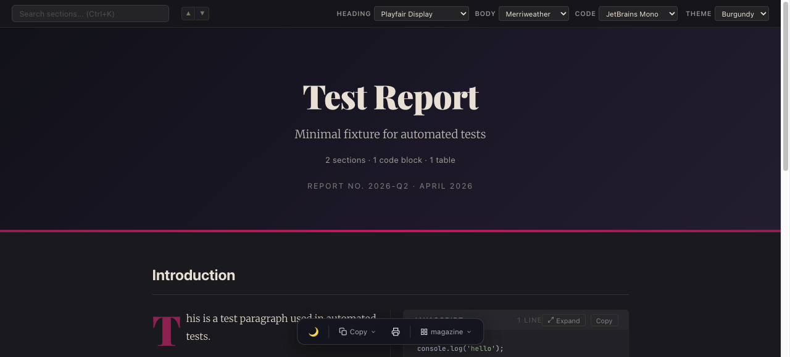<br/><sub>Editorial magazine layout with serif typography</sub></td>
<td align="center"><strong>jupyter</strong><br/>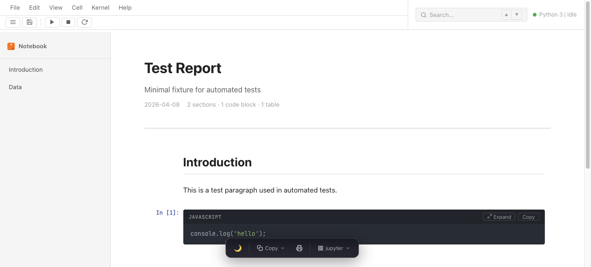<br/><sub>Jupyter notebook with executable-style cells</sub></td>
</tr>
<tr>
<td align="center"><strong>academic</strong><br/>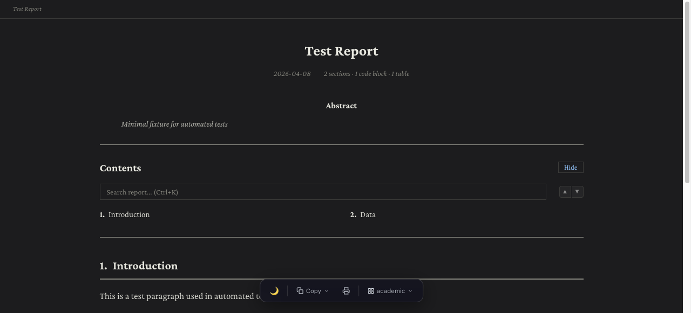<br/><sub>LaTeX-inspired academic paper with serif fonts</sub></td>
<td align="center"><strong>corporate</strong><br/>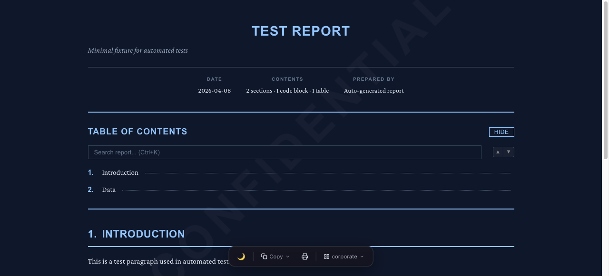<br/><sub>Formal corporate/legal report — print-ready</sub></td>
<td align="center"><strong>feed</strong><br/>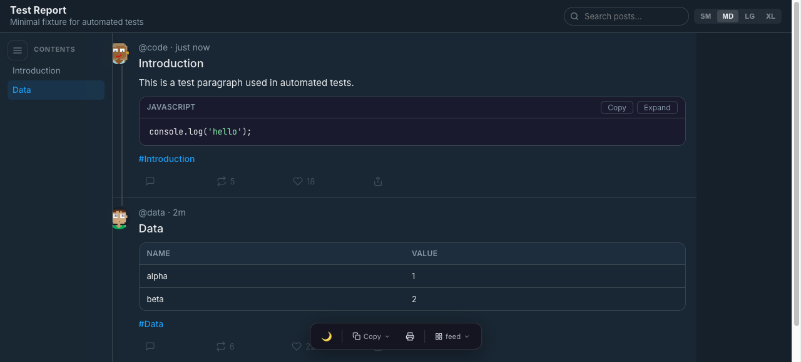<br/><sub>Social feed layout for narrative data — timeline cards</sub></td>
</tr>
<tr>
<td align="center"><strong>slide</strong><br/>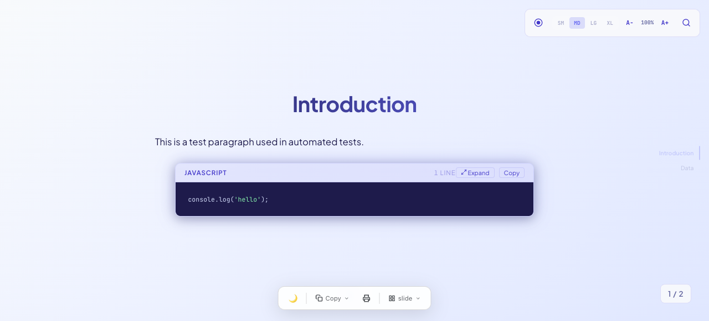<br/><sub>Presentation-style with full-viewport sections</sub></td>
<td align="center" colspan="2"><em>Browse all styles live in the <a href="https://alcatraz627.github.io/claude-reports/">Style Gallery</a></em></td>
</tr>
</table>

Every style includes:
- **Dark/light mode toggle** with localStorage persistence
- **Floating toolbar** with print, theme, and style picker
- **Syntax highlighting** for code blocks (20+ languages)
- **KaTeX math rendering** for LaTeX expressions
- **Search** across all sections
- **Responsive layout** for mobile/tablet/desktop

## Usage

### Generate a Single Style

```bash
npx tsx generate-html.ts <input.json> <output.html> --style <style_name>
```

### Generate All 13 Styles at Once

```bash
npx tsx generate-html.ts data.json output/ --all-styles
```

This creates `output/<style>/index.html` for each style plus a launcher page at `output/index.html`.

### Restyle Without Re-Parsing

Every generated report includes a `data.json` alongside the HTML. To switch styles:

```bash
bash restyle-report.sh <report_dir> <new_style>
```

### List Available Styles

```bash
bash scripts/list-styles.sh
```

### Interactive Table Generator

For tabular data (CSV/JSON), use the dedicated table generator:

```bash
npx tsx table/generate-table.ts data.json output.html \
  --title "Sales Report" \
  --search --pagination 25 --striped \
  --sort-by "Revenue:desc" --export csv
```

See [table/USAGE.md](table/USAGE.md) for the full flag reference.

## Project Structure

```
claude-reports/
├── generate-html.ts        Core HTML generator (1584 lines)
├── report.js               Default template client-side JS
├── shared.js               Shared JS modules (toolbar, search, copy, math)
├── shared-base.css          Shared base CSS (reset, variables, toolbar)
├── styles.css              Default template styles
├── restyle-report.sh       Zero-re-parse style switcher
├── package.json            Dependencies: tsx, vitest, playwright
├── scripts/
│   └── list-styles.sh      List all available styles
├── styles/
│   ├── academic/           Each style directory contains:
│   ├── corporate/            ├── meta.json      Style metadata
│   ├── dashboard/            ├── template.ts    HTML template
│   ├── data-table/           ├── style.css      Style-specific CSS
│   ├── feed/                 └── style.js       Style-specific JS
│   ├── jupyter/
│   ├── magazine/
│   ├── minimal/
│   ├── neon/
│   ├── notion/
│   ├── slide/
│   └── terminal/
├── table/
│   ├── generate-table.ts   Standalone table generator
│   └── USAGE.md            Table generator documentation
└── tests/
    ├── fixture.json        Test data fixture
    ├── static.test.ts      88 static HTML generation tests
    └── toolbar.spec.ts     Playwright browser interaction tests
```

## Testing

```bash
# Run static tests (no browser needed)
npm test

# Run Playwright browser tests
npx playwright test tests/toolbar.spec.ts
```

The static test suite validates all 13 styles for:
- Self-contained output (no external CSS/JS references)
- Floating toolbar presence and structure
- Theme toggle mechanism
- Content rendering accuracy

## Adding a New Style

1. Create a directory under `styles/<name>/`
2. Add four files:

   - **`meta.json`** — name, description, emoji, color
   - **`template.ts`** — exports `buildHtml(data: ReportData): string`
   - **`style.css`** — all CSS for the style
   - **`style.js`** — client-side interactivity, registers `window.__RPT_TOOLBAR`

3. The template imports shared helpers from `generate-html.ts`:
   ```typescript
   import type { ReportData } from "../../generate-html.ts";
   import { esc, renderBlock, renderSection, renderNav, computeStats } from "../../generate-html.ts";
   ```

4. Register `window.__RPT_TOOLBAR` with at least a `print` function:
   ```javascript
   window.__RPT_TOOLBAR = {
     print: function() { window.print(); },
     row2Html: '',
     row2Init: function() {},
   };
   ```

## Contributing

Contributions are welcome! Please open an issue or pull request.

## License

This project is open source.
